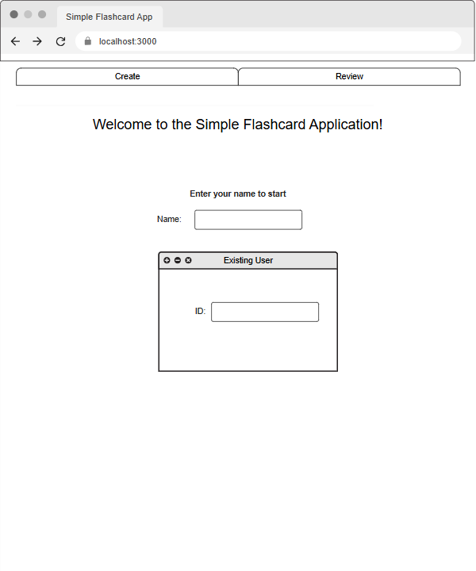
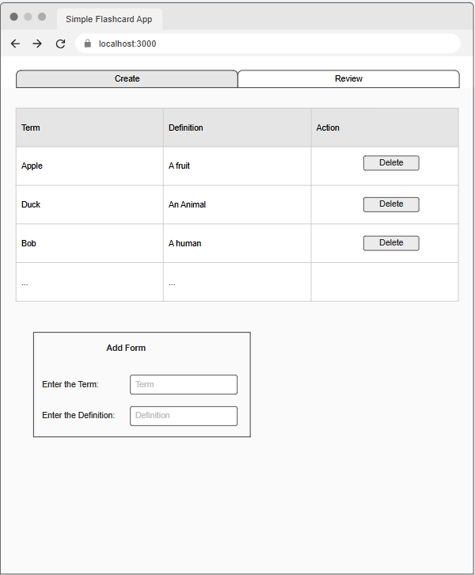
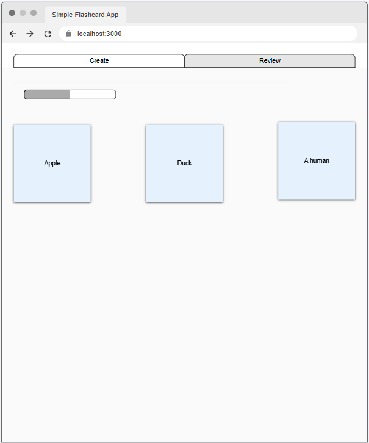

# Final Project

## Project Spec

The flashcard application is designed to allow users to create and review flashcards to study. The main landing page welcomes users and allows them to input their names. If the name already exists, a popup will prompt users to enter an ID; if the name does not exist, a popup will allow users to create an ID. The create and review pages are authenticated for usage, ensuring that users can only access their personalized flashcards.

The create page features an intuitive add form where users can create custom flashcards with terms on one side and answers on the other. Below the form is a table displaying all the flashcards the user has created, allowing for easy management. The table includes a delete button beside each row to remove unwanted cards, similar to the simple inventory lab from last week. This makes it simple for users to delete and recreate any cards necessary. It might be extended to edit after the basic functionalities are completed.

The review page will shuffle the cards each time the user clicks on the review tab and show them in random order for review, ensuring it's good for review every time. A progress bar will track how many flashcards have been reviewed, based on the number of interactions with the cards, giving users a visual indication of their progress.

The target audience for this application is the general public, with a leaning toward students who use flashcards to help with studying. The application manages several types of data: user names and IDs for authentication, flashcard data including terms and definitions, and a record of the progress made during reviews. The data should have different tables to manage each of them.

Once the basic functionality is implemented, additional features will be considered, such as the ability to categorize flashcards by subject to avoid having all cards in a single collection. This will make it easier for users to organize their study materials by topic, such as history, math, and science. Another feature involves replacing user IDs with passwords, creating a more secure environment where users can log in and manage their cards with more protection. This security enhancement will help safeguard user information and flashcard data. A third feature will allow users to assign colors to their cards, increasing accessibility for users with visual impairments. This will help users who may have difficulty seeing certain colors or who might benefit from personalized color schemes to improve focus. Color customization options will be provided to allow users to select colors that work best for them, whether for better contrast or better focus.

For user accessibility, I will implement keyboard navigation so the app can be fully used without a mouse. The progress bar will show both a visual indicator and a numerical percentage. Tables will be labeled clearly for screen readers. The layout will be simple, clean, and user-friendly, ensuring ease of navigation for all users, including those with disabilities. The overall color scheme will most likely be light blue or light green for a fresh look. 

## Project Wireframe







## Overview

A flashcard application that allows users to create, review, and study custom flashcards. The Create feature displays a table of all terms and definitions, Review lets users flip the cards interactively, and Study enables users to match terms with their definitions.

## Testing
For simple testing API using curl, please use 
1. Make the script executable with 
```bash
chmod +x api_smoke_test.sh.
```
2. Run the script with 
```bash
./api_smoke_test.sh.
```

For unit testing 
1. Install Jest and JSDOM using command 
```bash
npm install --save-dev jest jsdom
```
2. Run the tests through terminal using command 
```bash
npx jest
```

## Running Webpage

1. Download VSCode
2. Install VSCode plugin "Live Preview"
3. Right click on the index.html and select "Show Preview" to view it on its development server
4. Enjoy interacting with the webpage freely.

## Resources
- DynamoDB data structure: https://docs.aws.amazon.com/amazondynamodb/latest/developerguide/HowItWorks.Partitions.html

- Client-side web APIs: "https://developer.mozilla.org/en-US/docs/Learn/JavaScript/Client-side_web_APIs" 

- Lambda Function: "https://chatgpt.com/"

- Tables: "https://developer.mozilla.org/en-US/docs/Learn/HTML/Tables/Advanced"

- Local Storage: "https://www.tutorialspoint.com/can-i-pass-a-value-from-one-html-page-to-another-html-page-without-passing-it-in-url"

- Flashcard CSS: "https://www.w3schools.com/howto/howto_css_flip_card.asp"

- Scrollable table: "https://www.w3schools.com/howto/howto_css_table_responsive.asp"

- Event target for buttons: "https://www.w3schools.com/jsref/event_target.asp"

- Select and unselect buttons: "https://stackoverflow.com/questions/8344712/javascript-buttons-select-and-unselect"

- Fisher-Yates shuffle Algorithm: "https://www.geeksforgeeks.org/shuffle-a-given-array-using-fisher-yates-shuffle-algorithm/"

- Wrapping and breaking text: "https://developer.mozilla.org/en-US/docs/Web/CSS/CSS_text/Wrapping_breaking_text"

- Jesting testing: "https://jestjs.io/docs/mock-functions"

- VSCode Copilot extension for testing scenarios 

